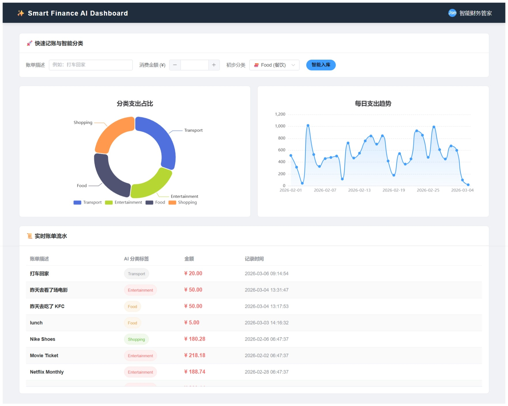

# Smart Finance: 基于云原生架构的智能个人财务系统

## 项目简介
本项目是一个全栈前后端分离的智能财务管理生态系统。旨在通过人工智能算法对用户的日常账单进行智能语义分析与自动分类，并通过动态可视化大屏进行深度数据洞察。

项目采用企业级**云原生微服务架构**，各业务模块彻底解耦，并支持基于 Docker Compose 的一键式自动化部署。

## 📸 系统运行实况

## 核心技术栈
* **前端交互端 (Frontend):** Vue 3 + Vite + Element Plus + ECharts 数据可视化 
* **核心业务端 (Backend):** Java 17 + Spring Boot 3 + RESTful API
* **智能算法节点 (AI Node):** Python 3.12 + FastAPI + 机器学习分类算法
* **数据持久层 (Database):** MySQL 8.0
* **云原生 DevOps:** Docker + Docker Compose 容器化编排

## 核心工程亮点
1. **跨语言微服务通信:** 实现 Java 业务中枢与 Python 算力节点的高效解耦与交互。
2. **极简自动化部署:** 彻底解决环境一致性问题，实现 `Any Environment, One Command` 极速启动。
3. **企业级 UI 规范:** 摒弃传统原生标签，全量接入大厂级组件库，保障交互丝滑与视觉统一。